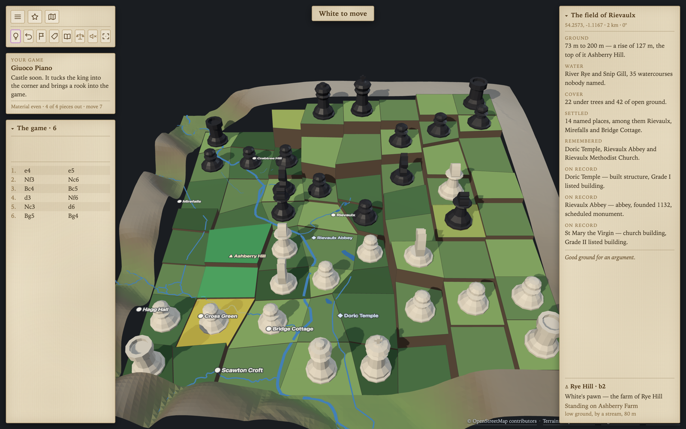
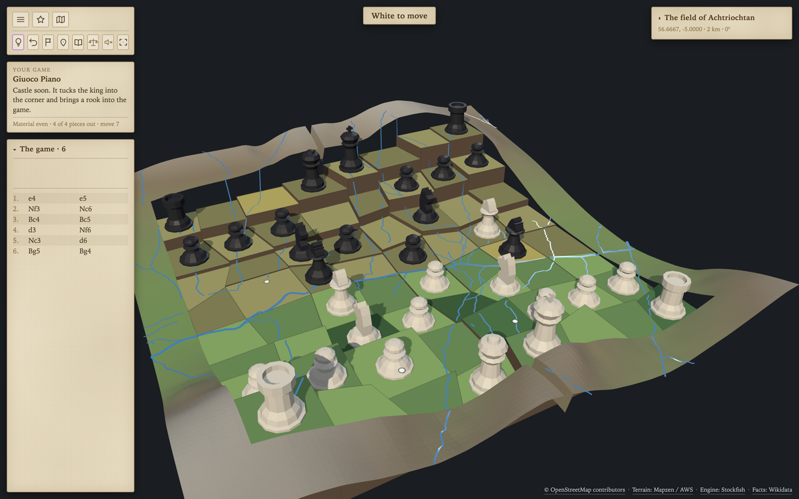
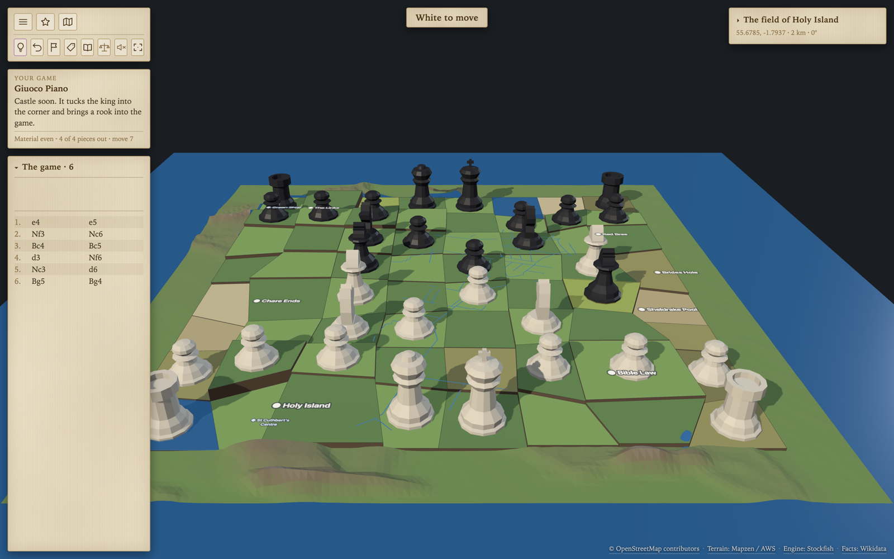
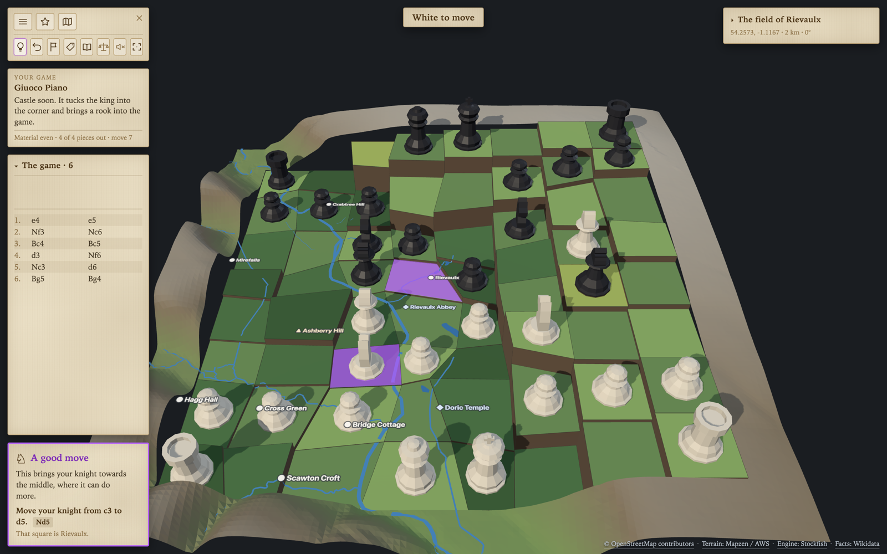

# MapChess

Pick a real place on a map. Its hills, rivers, coastline, forests and old place names become a 3D chessboard of 64 irregular cells. Play chess on it against the computer.

There are no buildings. The landscape is the board.

Every piece is somebody. Click White's rook at Rievaulx and a card names it — _Ashberry Hill, the highest ground on this side, 169 m_. The bishop is the abbey; the knight is the river crossing. Black takes its own identities from its own half of the valley.

## Play it

**<https://salpbes.github.io/MapChess/>** — no install, no account. It runs entirely in the browser; the chess engine is WebAssembly and the terrain is fetched from public map data.

## Status

**Phase 12 of 12, deployed.** Playable end to end: choose a place, play the computer on its terrain, take back, resign, resume. See [docs/PROGRESS.md](docs/PROGRESS.md) for the report on each phase.

## Screenshots

**Rievaulx, North Yorkshire** — the River Rye valley below the abbey, six moves into a Giuoco Piano. The gazetteer on the right is counted from the map data; the dates come from Wikidata by the Q-id OpenStreetMap already carries. The selected pawn stands on Ashberry Farm.



**Glen Coe, Highlands** — the same 64 squares on ground that rises 300 m across the board. Every cell is terraced to its own mean height, so the glen is playable and still recognisably a glen.



**Holy Island of Lindisfarne** — squares whose ground sits at or below sea level are drawn as water rather than beach, so a piece there stands in the shallows and the square is still one of the 64.



**A hint, for anyone still learning.** The engine is asked at full strength whatever level the opponent is set to, and the answer is spelled out in words, with the notation beside it and the name of the map cell it lands on.



## Run

```sh
npm install
npm run dev        # http://localhost:5173
npm run test       # Vitest — domain, game and map data
npm run lint
npm run typecheck
npm run build      # typecheck, then a production build into dist/
npm run preview    # serve dist/ to check the real build
```

Three offline example areas ship with the project — Rievaulx, Lindisfarne and Glen Coe — so development never depends on the network. Add `?debug` to the URL for the terrain, feature and frame-rate panels.

## How to play

- **Click a piece, then its destination.** Legal moves are lit; captures are lit differently.
- **Castle** by clicking your king and then the rook you want to castle with.
- **Drag** to orbit, **right-drag** or two fingers to slide the board, **scroll** to zoom.
- **Hint** shows a strong move and says why, whatever difficulty you are playing.
- Five levels, from _Learner_ — which will hang pieces — to the unrestricted engine.

## Deploying

`npm run build` produces a `dist/` folder of static files with relative asset
paths, so it runs from a domain root, a project subpath, or a plain directory.
Drop it on any static host — no server, no build step, no environment
variables. The chess engine is WebAssembly served from `dist/engine/`; the host
must send `.wasm` as `application/wasm`, which every mainstream host does.

Nothing is required at runtime except the browser. Elevation and map features
are fetched from public APIs and cached in IndexedDB; a failure shows an error
with a retry rather than breaking the game.

### GitHub Pages

`.github/workflows/deploy.yml` builds and publishes on every push to `main`,
after running lint, formatting, types and the test suite — a deploy that skips
the suite is a deploy that ships a red build. To set it up once:

1. Create an empty repository on GitHub.
2. `git remote add origin git@github.com:<you>/<repo>.git`
3. `git push -u origin main`
4. **Settings → Pages → Source: GitHub Actions.**

The site then appears at `https://<you>.github.io/<repo>/`. Nothing needs to
know the repository name: `base: './'` in `vite.config.ts` keeps every asset
path relative, and the engine is loaded from `import.meta.env.BASE_URL`, so the
same build works from a subpath and from a domain root.

The engine binaries are not in the repository — `public/engine/` is ignored and
`npm ci` runs the postinstall that copies them out of `node_modules/stockfish`.

## Data and licences

The board is made of other people's work, credited on screen and here:

| Source                                                                                | Used for                                     | Licence                                             |
| ------------------------------------------------------------------------------------- | -------------------------------------------- | --------------------------------------------------- |
| [OpenStreetMap](https://www.openstreetmap.org/copyright)                              | Rivers, woods, peaks, coastline, place names | ODbL — **attribution required**                     |
| [Mapzen Terrain Tiles](https://registry.opendata.aws/terrain-tiles/) on AWS Open Data | Ground heights                               | Public sources; credit requested                    |
| [Wikidata](https://www.wikidata.org/)                                                 | Founding dates, heritage listings            | CC0                                                 |
| [OpenFreeMap](https://openfreemap.org/) + [MapLibre](https://maplibre.org/)           | The 2D area picker's basemap                 | Open                                                |
| [Stockfish](https://stockfishchess.org/)                                              | The opponent                                 | GPL-3.0 — see `public/engine/LICENSE-stockfish.txt` |

The ODbL requires the OpenStreetMap credit to be visible wherever the data is,
so it is a line in the corner of the running app, not only in this file.

## Docs

- [docs/BUILD_PLAN.md](docs/BUILD_PLAN.md) — the plan, phase by phase
- [docs/PROGRESS.md](docs/PROGRESS.md) — one report per completed phase
- [docs/DECISIONS.md](docs/DECISIONS.md) — every non-obvious choice, with reasons

Every folder under `src/` has a `README.md` describing what belongs in it. The
rule that keeps the project modular: **`domain/` never imports three.js and
never touches the DOM**, enforced by ESLint rather than by good intentions.
